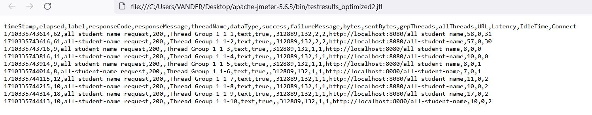

Minggu 5 

Test Plan 1 dalam JMeter untuk endpoint /all-student, 2 untuk endpoint /all-student-name, dan 3 untuk endpoint /highest-gpa. 

Apakah ada peningkatan performa yang bisa diukur setelah mengoptimisasi kode untuk tiga method di service yang berkaitan dengan tiga endpoint? Iya. Ada.

Dilihat dari file jtl, bisa dikatakan semuanya meningkat.
Dari 140 ribuan dalam elapsed time ms ke satu ribuan untuk endpoint pertama (/all-student)
Dari 4 ribuan dalam elapsed time ms ke puluhan untuk endpoint kedua (/all-student-name)
Dari range [34,99] ms dalam elapsed time ke [5,64] ms untuk endpoint ketiga (/highest-gpa)

Kemudian, ada juga hasil dari Profiler milik Intellij.

Dan enam hasil profiling di atas berbicara sendiri.

Secara umum, metode lama yang melibatkan pembuatan objek dalam Java inferior (dalam segi waktu eksekusi) dibandingkan dengan memanfaatkan @Query annotation di interfaca masing-masing repository dan memanggil method yang berkaitan dalam service! 

Untuk menjawab ketujuh pertanyaan:
1. JMeter digunakan untuk pengujian beban dan mengukur performance aplikasi secara menyeluruh, sedangkan IntelliJ Profiler digunakan membuat profil tingkat kode untuk mengidentifikasi masalah performance dalam method dan class tertentu.
2. Pembuatan profil membantu mengidentifikasi bottleneck performance dengan memberikan informasi terperinci tentang waktu eksekusi, beban CPU, dan konsumsi memori masing-masing method dan class dalam kode Java yang saya tulis.
3. Ya. IntelliJ Profiler alat yang baik untuk menganalisis dan mengidentifikasi masalah dalam kode java,  fitur seperti analisis tree call, sinkronisasi method, dan pelacakan memori jika ada penggunaan memori yang tidak wajar.
4. Tantangan pengujian performance dan pembuatan profil mencakup mereproduksi skenario yang sesuai, menangani data  jumlah besar dari database, serta menginterpretasikan hasil. Hal ini dapat diatasi dalam lingkungan teoritis yang ideal dengan menggunakan data pengujian yang realistis dan lengkap dan melakukan simulasi lingkungan produksi.
5. Manfaat menggunakan IntelliJ Profiler mencakup informasi performance terperinci, integrasi dengan IntelliJ IDE, representasi visual data performance, dan dukungan untuk berbagai mode pembuatan profil.
6. Jika hasil pembuatan profil tidak sesuai dengan hasil pengujian performance JMeter, analisis perbedaan tersebut dengan meninjau skenario yang sebanding, berpikir, melakukan pembuatan profil atau pengujian yang ditargetkan, dan bekerja sama dan bertanya kepada orang lain untuk menemukan solusi.
7. Setelah menganalisis hasil performance, strategi optimisasi mencakup meminimalkan pembuatan objek, mengoptimalkan pembuatan kueri database yang berdasarkan PostGRESQL.
